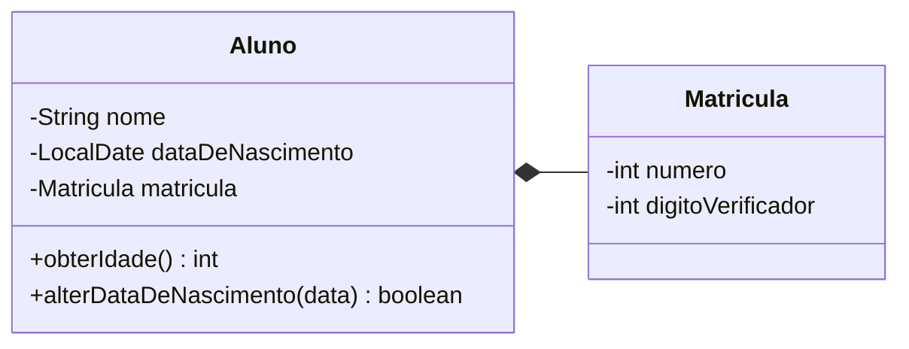
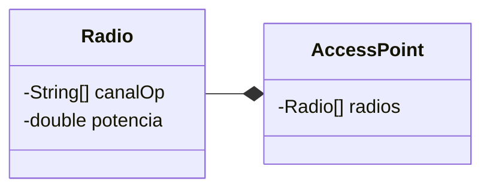
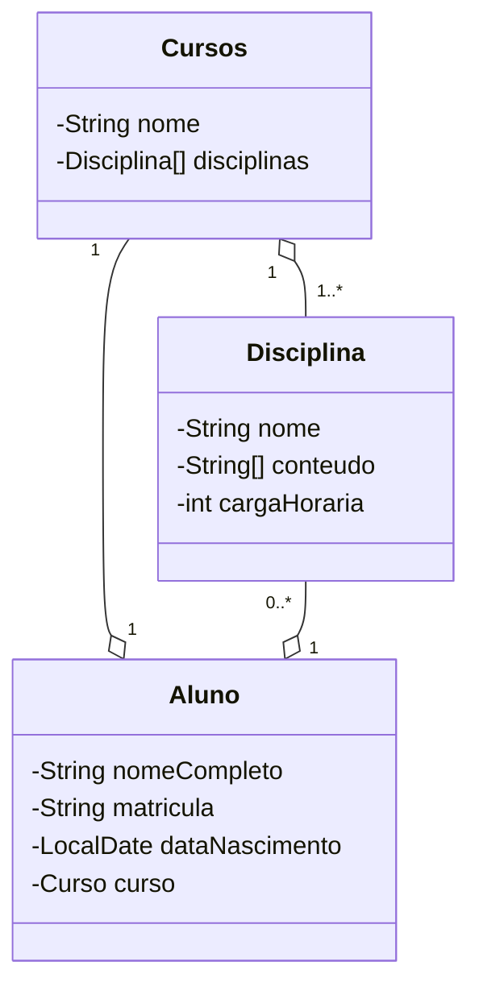
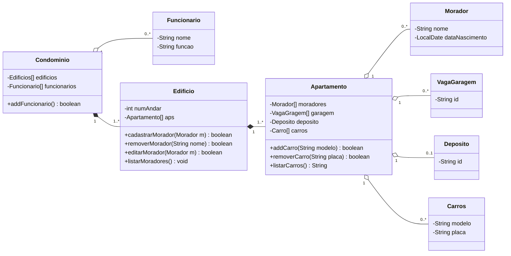
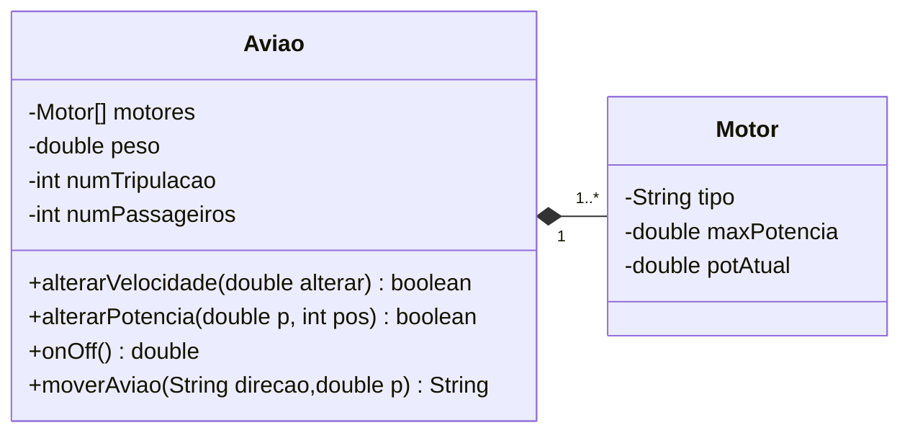

```mermaid
classDiagram
    direction LR

    class Aluno{
      -String nome
      -LocalDate dataDeNascimento
      -Matricula matricula
      +obterIdade() int
      +alterDataDeNascimento(data) boolean
    }

    class Matricula{
      -int numero
      -int digitoVerificador
    }

    Aluno *-- Matricula
```

```mermaid
classDiagram
direction RL
    
    class Radio{
        -String[] canalOp
        -double potencia
    }
    
    class AccessPoint{
        -Radio[] radios
 }

    AccessPoint *-- Radio
```

```mermaid
classDiagram

    class Aluno{
    -String nomeCompleto
    -String matricula
    -LocalDate dataNascimento
    -Curso curso
    }
    
    class Disciplina{
        -String nome
        -String[] conteudo
        -int cargaHoraria
    }
    
    class Cursos{
        -String nome
        -Disciplina[] disciplinas 
    }
    
    Cursos "1" o-- "1..*" Disciplina
    Cursos "1" --o "1" Aluno
    Disciplina "0..*" --o "1" Aluno
```

```mermaid
classDiagram
    direction LR
    
    class Morador{
        -String nome
        -LocalDate dataNascimento
    }

    class Apartamento{
        -Morador[] moradores
        -VagaGragem[] garagem
        -Deposito deposito
        -Carro[] carros
        
        +addCarro(String modelo)boolean
        +removerCarro(String placa)boolean
        +listarCarros()String
    }
    
    class Funcionario{
        -String nome
        -String funcao
    }


    class VagaGaragem{
    -String id
    }

    class Deposito{
    -String id
    }

    class Carros{
    -String modelo
    -String placa
    }

    class Edificio{
        -int numAndar
        -Apartamento[] aps
        +cadastrarMorador(Morador m) boolean
        +removerMorador(String nome)boolean
        +editarMorador(Morador m)boolean
        +listarMoradores()void
    }
    
    
class Condominio{
    -Edificios[] edificios
    -Funcionario[] funcionarios
    
    +addFuncionario() boolean
}

Condominio "1" *-- "1..*" Edificio
Condominio "1" o-- "0..*" Funcionario
Edificio "1" *-- "1..*" Apartamento
Apartamento "1" o-- "0..*" Morador
Apartamento "1" o-- "0..*" VagaGaragem
Apartamento "1" o-- "0..1" Deposito
Apartamento "1" o-- "0..*" Carros

```

```mermaid
classDiagram
    direction LR

    class Motor{
        -String tipo
        -double maxPotencia
        -double potAtual
    }

    class Aviao{
        -Motor[] motores
        -double peso
        -int numTripulacao
        -int numPassageiros
        
        +alterarVelocidade(double alterar) boolean
        +alterarPotencia(double p, int pos) boolean
        +onOff()double
        +moverAviao(String direcao,double p) String
    }

Aviao "1" *-- "1..*" Motor

```

