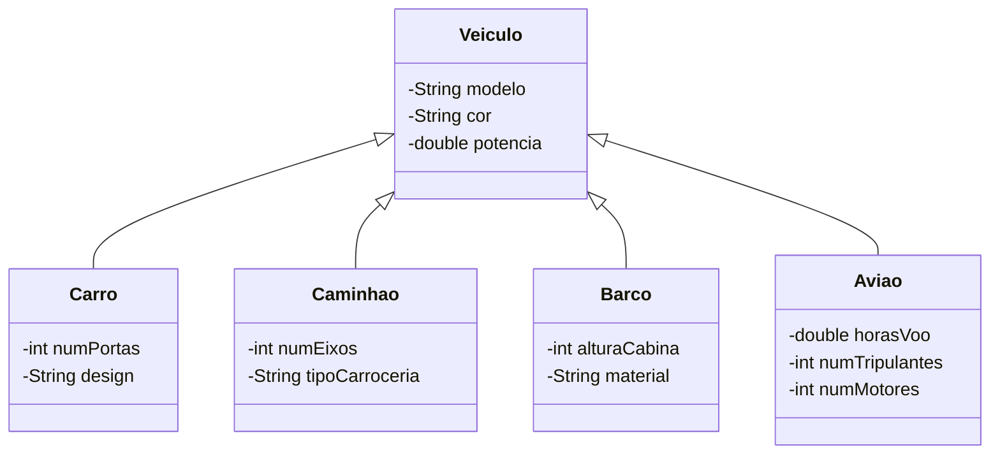

```mermaid
classDiagram

class Veiculo{
    -String modelo
    -String cor
    -double potencia
}


class Carro{
    -int numPortas
    -String design
}

class Caminhao{
    -int numEixos
    -String tipoCarroceria
}

class Aviao{
    -double horasVoo
    -int numTripulantes
    -int numMotores
}

class Barco{
    -int alturaCabina
    -String material
}

Veiculo <|-- Carro
Veiculo <|-- Caminhao
Veiculo <|-- Barco
Veiculo <|-- Aviao
```