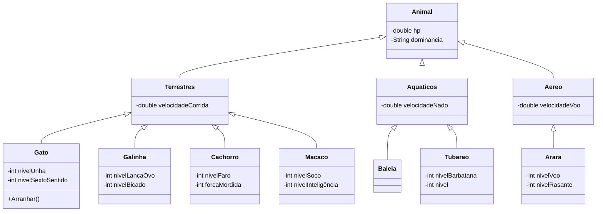

```mermaid
classDiagram

class Animal{
   -double hp
   -String dominancia
}

class Aquaticos{
    -double velocidadeNado
}

class Terrestres{
    -double velocidadeCorrida
}

class Aereo{
    -double velocidadeVoo
}

class Gato{
    -int nivelUnha
    -int nivelSextoSentido
    
    +Arranhar()
}

class Baleia{
    
}

class Cachorro{
    -int nivelFaro
    -int forcaMordida
}

class Galinha{
    -int nivelLancaOvo
    -int nivelBicado
}

class Macaco{
    -int nivelSoco
    -int nivelInteligência
    
}

class Arara{
    -int nivelVoo
    -int nivelRasante
}

class Tubarao{
    -int nivelBarbatana
    -int nivel
}

Animal <|-- Terrestres
Animal <|-- Aquaticos
Animal <|-- Aereo

Terrestres <|-- Gato
Terrestres <|-- Galinha
Terrestres <|-- Cachorro  
Terrestres <|-- Macaco

Aquaticos <|-- Baleia
Aquaticos <|-- Tubarao

Aereo <|-- Arara


```