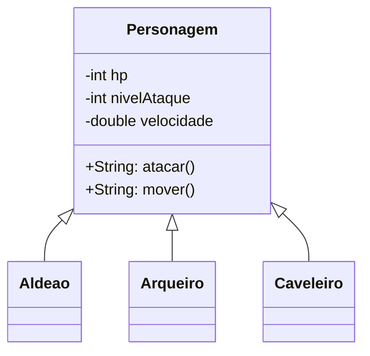

```mermaid

classDiagram
    
    class Personagem{
        -int hp
        -int nivelAtaque
        -double velocidade
        
        +String: atacar()
        +String: mover()
    }
    
    class Aldeao{
        
    }

    class Arqueiro{
        
    }
    
    class Caveleiro{
        
    }
    
    Personagem <|-- Aldeao
    Personagem <|-- Arqueiro
    Personagem <|-- Caveleiro

```