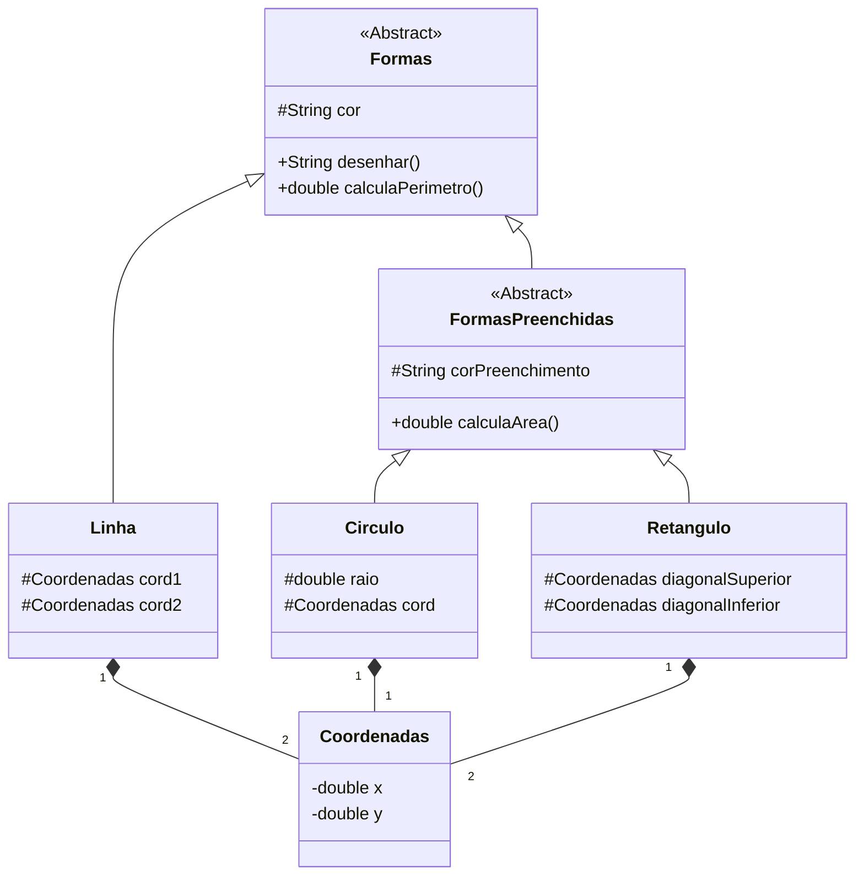

```mermaid

classDiagram
    
    class Formas{
        <<Abstract>>
        
        #String  cor
        
        +String desenhar()
        +double calculaPerimetro()
    }
    
    class FormasPreenchidas{
        <<Abstract>>
        
        #String corPreenchimento
        
        +double calculaArea()
    }
    
    class Linha{
        #Coordenadas cord1
        #Coordenadas cord2
    }
    class Circulo{
        #double raio
        #Coordenadas cord
    }
    
    class Retangulo{
        #Coordenadas diagonalSuperior
        #Coordenadas diagonalInferior
    }
    
    class Coordenadas{
        -double x
        -double y
    }
    
    
    
    Formas <|-- FormasPreenchidas
    Formas <|-- Linha
    FormasPreenchidas <|--Circulo
    FormasPreenchidas <|-- Retangulo
    
    Linha "1" *-- "2" Coordenadas
    Circulo "1" *-- "1" Coordenadas
    Retangulo "1" *-- "2" Coordenadas
```